<!---
rifezacharyd/rifezacharyd is a ✨ special ✨ repository because its `README.md` (this file) appears on your GitHub profile.
--->

# Zachary D. Rife

### Veteran · Volunteer · Computer Science Student

*I'm also the Founder of [Ridgeview Ledger Co](https://ridgeviewledgers.com/), a Financial Technology Consulting company developing  integrating and managing digital financial systems, and also [ZeroDayResearch.Dev](https://zerodayresearch.dev/) where I develop software, hardware, and other technologies, and perform security research and remediation missions for local organizations.*

📍 Abingdon, Virginia  &nbsp;·&nbsp;  🌐 <a href="https://rifezacharyd.github.io">The Binary Journal</a>  &nbsp;·&nbsp;  📫 <a href="mailto:zdrife@liberty.edu">zdrife@liberty.edu</a>

 

---

## 👋 About

I'm an Expert Bookkeeper at **Intuit, Inc.** and a Computer Science student at **Liberty University**, pursuing a combined **BS in Computer Science with special coursework in Cybersecurity**. My long-term goal is to pursue an internal move at Intuit to join the Product Development team.

Before my career in tech, I served as a Military Police Officer in the Virginia Army National Guard. I'm still serve my community as a volunteer firefighter with the [Hiltons VFD](https://hiltonsvfd.org/) and as the elected Club Secretary of the [Bristol Twin Cities Lions Club](https://bristollions.org/).

## 🎯 Currently

- 💼 &nbsp;Working at **Intuit, Inc.**, with eyes on the Product Development team
- 🎓 &nbsp;Starting a 7-semester BS+MS CS/Cybersecurity plan at Liberty Online — **Fall 2026 → Fall 2028**
- ✍️ &nbsp;Writing case studies, research summaries, and lab notes on [**The Binary Journal**](https://rifezacharyd.github.io)
- 📊 &nbsp;Bridging statistics and security in the [`data-science`](https://github.com/rifezacharyd/data-science) repo
- 🧠 &nbsp;Reading everything I can get my hands on about supply-chain security and secure software engineering

---

## 🗂️ Portfolio

A scaffolded set of public repositories that grow alongside my coursework and independent research. Each one has a clear purpose — together they're meant to read as a single, coherent body of work rather than a graveyard of half-finished side projects.

### ✍️ Writing & Research

| Repository | What's inside |
| :--- | :--- |
| 🌐 [**rifezacharyd.github.io**](https://github.com/rifezacharyd/rifezacharyd.github.io) | *The Binary Journal* — my Jekyll-powered blog covering security research, data analysis, programming, and industry news. |
| 🔬 [**case-studies**](https://github.com/rifezacharyd/case-studies) | Long-form technical case studies on landmark cybersecurity incidents — Stuxnet, SolarWinds, NotPetya, Log4j, xz, 3CX, Kaseya, and the rest of the canon. |
| 📰 [**technology-news**](https://github.com/rifezacharyd/technology-news) | Curated notes on emerging threats, industry shifts, and stories worth revisiting. |

### 🎓 Coursework

| Repository | What's inside |
| :--- | :--- |
| 💻 [**computer-science**](https://github.com/rifezacharyd/computer-science) | Algorithms, data structures, architecture, and systems coursework. |
| 📊 [**data-science**](https://github.com/rifezacharyd/data-science) | Statistical and data analysis projects in R and Python — including the MATH 211 portfolio project on the UNSW-NB15 intrusion detection dataset. |
| 🧑‍💻 [**programming**](https://github.com/rifezacharyd/programming) | Language-focused exercises, reference snippets, and small working examples. |

### 🛡️ Security

| Repository | What's inside |
| :--- | :--- |
| 🔐 [**security**](https://github.com/rifezacharyd/security) | Defensive security notes, lab write-ups, and tooling I build while working through the cybersecurity specialization. |

### ⚡ Electronics

| Repository | What's inside |
| :--- | :--- |
| 🔌 [**electronics**](https://github.com/rifezacharyd/electronics) | Arduino projects, pin configurations, circuit theory, and foundational electronics grounded in Rosenberg's *Audel Basic Electronics*. |

---

## 🛠️ Tech Stack

**Languages**

**Tools & Platforms**

---

## 📈 GitHub Stats

 

Auto-updated every 6 hours via <a href="https://github.com/lowlighter/metrics">lowlighter/metrics</a>.

---

## 🧭 Background

### 🎓 Education

| School             | Program                                    | Degree | Timeline                  |
| :----------------- | :----------------------------------------- | :----- | :------------------------ |
| Liberty University | Computer Science — Cybersecurity           | B.S.   | Spring 2026 – Fall 2027   |
| Liberty University | Psychology                                 | A.A.   | Fall 2024 – Fall 2025     |

Dual-enrollment track — graduate coursework begins during the final undergraduate semesters.

### 💼 Experience

- **Intuit** &nbsp;·&nbsp; *Present* — Software professional, working toward an internal move to the Product Development organization.
- **Virginia Army National Guard** &nbsp;·&nbsp; *January 2013 – January 2021* — Enlisted Military Police Officer, based out of Manassas, VA.

### 🤝 Public Service

- 🚒 &nbsp;**Hiltons Volunteer Fire Department** — Volunteer Firefighter *(October 2024 – Present)*
- 🦁 &nbsp;**Bristol Twin Cities Lions Club** — Club Secretary *(elected June 2024 – Present)*
- 🎖️ &nbsp;**Department of Defense VAARNG** — Enlisted Military Police Officer *(2013 – 2021)*

### 🗣️ Human Languages

English *(native)* &nbsp;·&nbsp; French 

---

> *"As for the future, your task is not to foresee it, but to enable it."*
>
> — Antoine de Saint-Exupéry

 

Thanks for stopping by. If any of this overlaps with what you're working on, my inbox is open.

